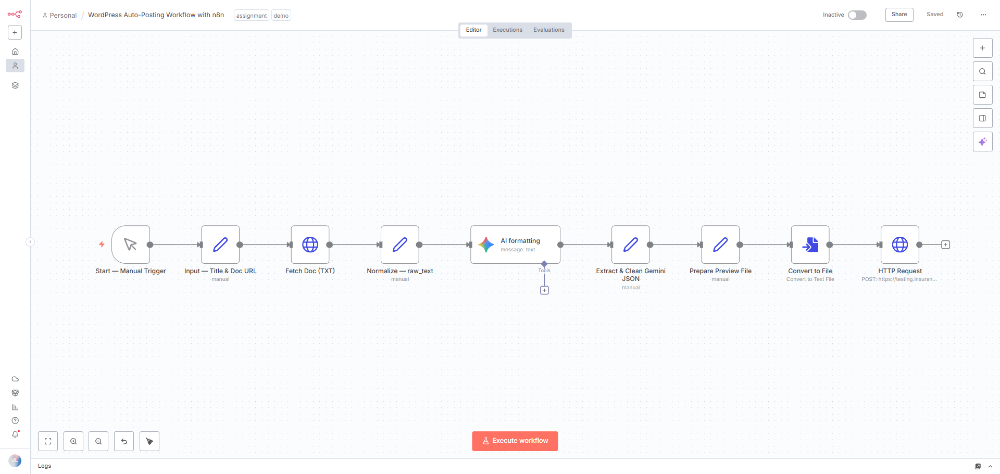

## WordPress Auto-Posting Workflow (n8n)

### Overview
This workflow automates the creation of WordPress draft posts from Google Docs or TXT files.  
It uses Gemini AI to generate structured article JSON (title, excerpt, content, hero prompt, etc.), converts it to HTML, and posts it directly to WordPress via the REST API.

<em>Figure 1 — n8n workflow from input to WordPress post creation.</em>

##

### Workflow Steps
1. **Input — Title & Doc URL**  
   Manual input of a document link and optional title.
2. **Fetch Doc (TXT)**  
   Retrieves the document text from the provided link.
3. **Normalize — raw_text**  
   Cleans and prepares the text for AI formatting.
4. **AI Formatting (Gemini)**  
   Generates structured JSON with title, excerpt, content HTML, and metadata.
5. **Extract & Clean Gemini JSON**  
   Parses the AI output into usable fields.
6. **Prepare Preview File**  
   Builds filename and clean HTML content.
7. **Convert to File**  
   Converts HTML content into a `.html` preview file.
8. **HTTP Request — WordPress**  
   Sends the article data (title, content, excerpt, status=draft) to the WordPress REST API.

##

### WordPress Integration
- **Endpoint:** `https://your-site.com/wp-json/wp/v2/posts`
- **Auth:** Basic Auth with a WordPress Application Password.
- **Status:** Posts are created as *drafts* by default.

##

### How to Run
1. Open n8n editor.
2. Import `wordpress-auto-posting.json`.
3. Set up Gemini and WordPress credentials.
4. Run the workflow manually or via Webhook input.

##

### Example Output
- Post title: `Common Insurance Claims in HR Consulting`
- Status: `draft`
- WordPress response: `201 Created`
- HTML preview: `common-insurance-claims-in-hr-consulting.html`

##

### Additional Notes
- Duplicate and category automation are optional and excluded for simplicity.
- This workflow does **not** require Google Drive OAuth.
- Can be triggered manually or extended with a Webhook input for automation.

